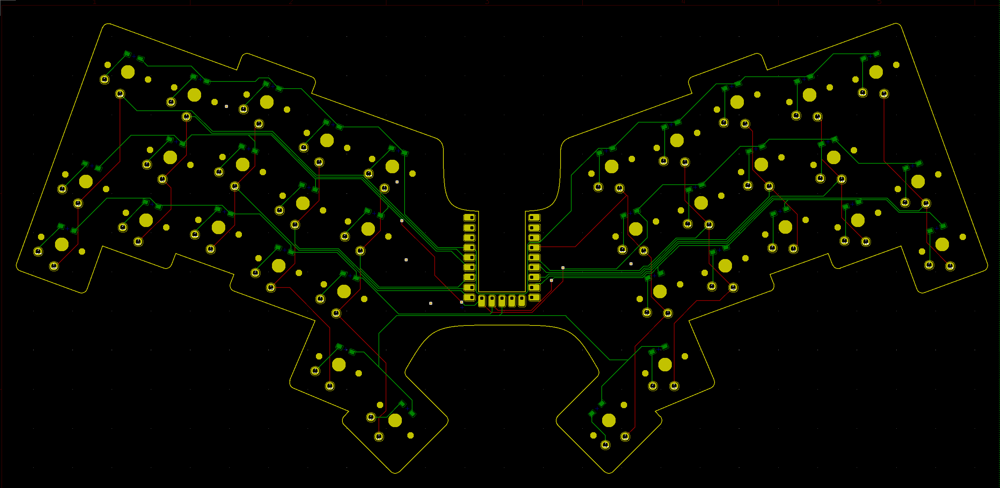

# gku34

* 狭ピッチ
  * キーピッチが縦17mmx横18mm
* KiCad 6 で作成
* [horizon プラグイン](https://github.com/skarrmann/horizon/blob/5833ec133d5f8fa4f3824622efd5dbfc89d797ec/kicad-plugins/horizon-board-producer-plugin.py)を使ってボトムプレートを生成
* choc v1 (rev0.1, rev0.2)
* Lofree switch (rev0.3)

## LICENSE

 この作品は <a rel="license" href="http://creativecommons.org/licenses/by/4.0/">クリエイティブ・コモンズ 表示 4.0 国際 ライセンス</a>の下に提供されています。

> 共有 — どのようなメディアやフォーマットでも資料を複製したり、再配布できます。
> 
> 翻案 — マテリアルをリミックスしたり、改変したり、別の作品のベースにしたりできます。営利目的も含め、どのような目的でも。
