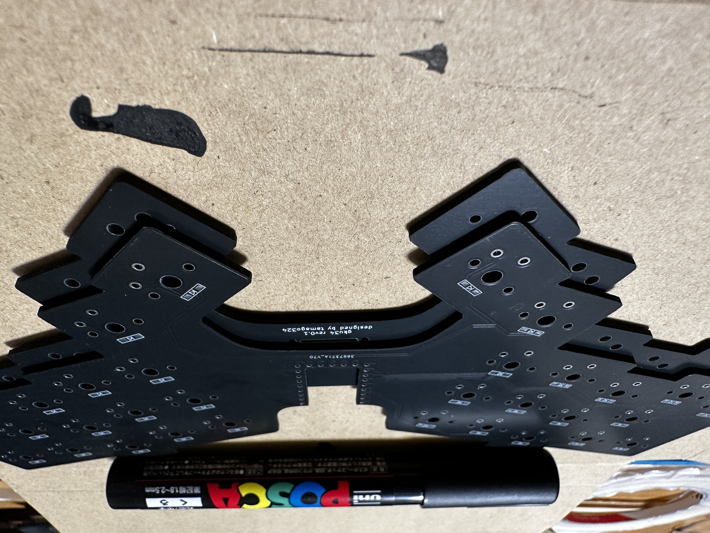
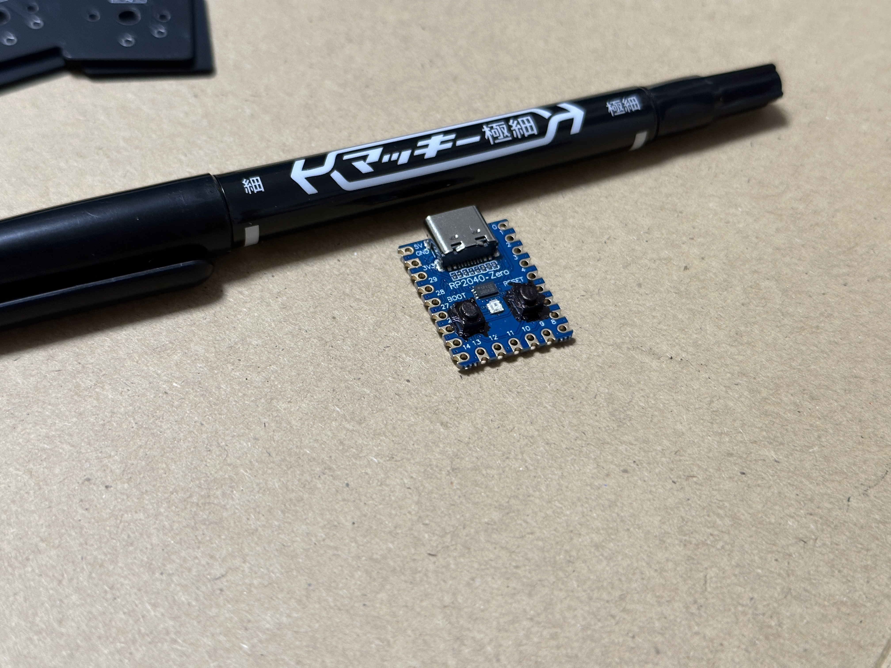
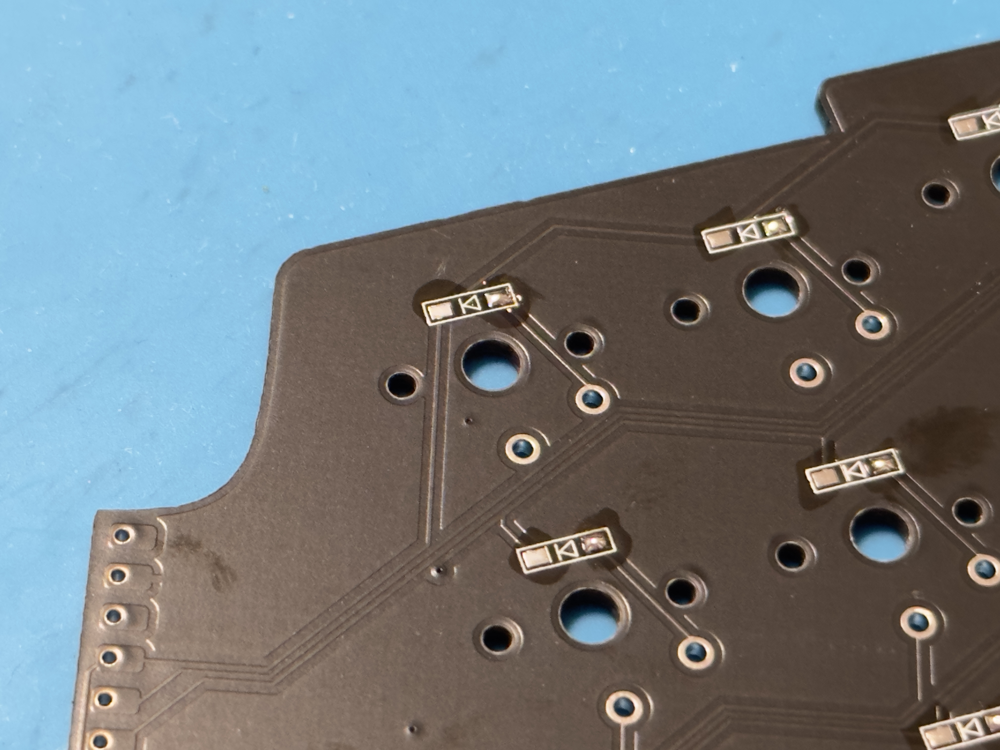
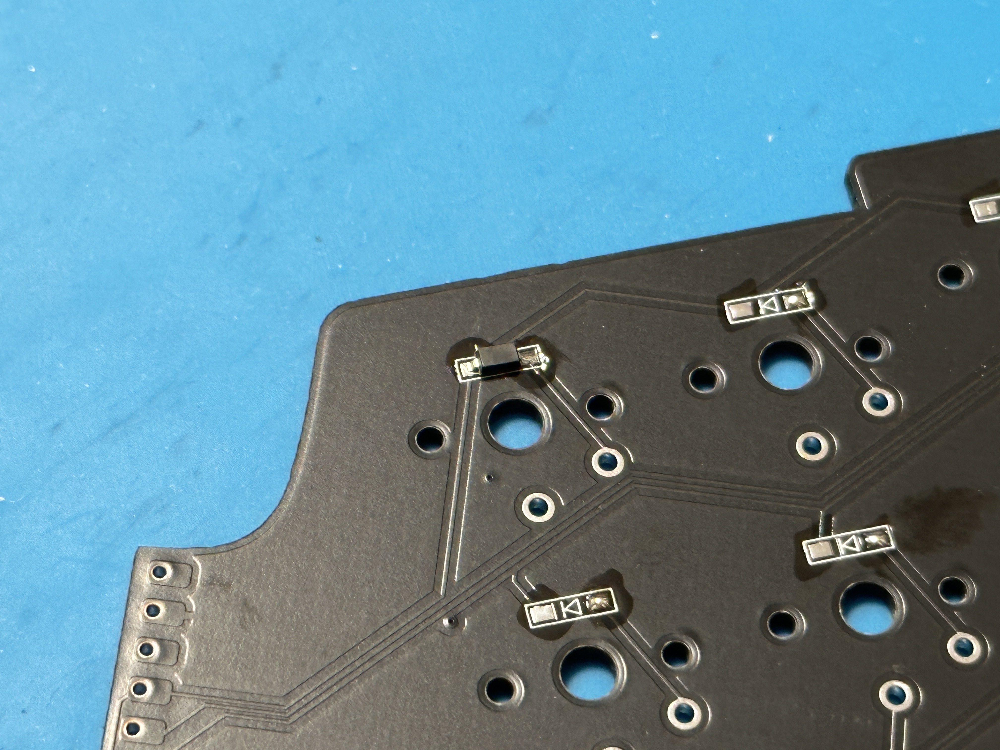
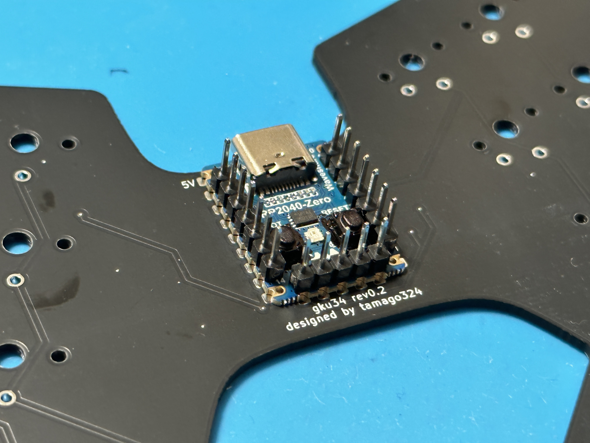
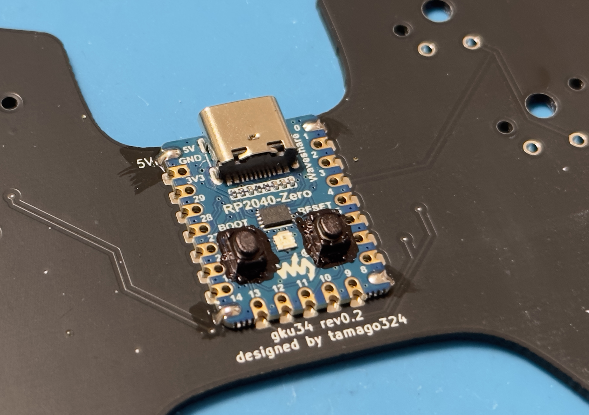
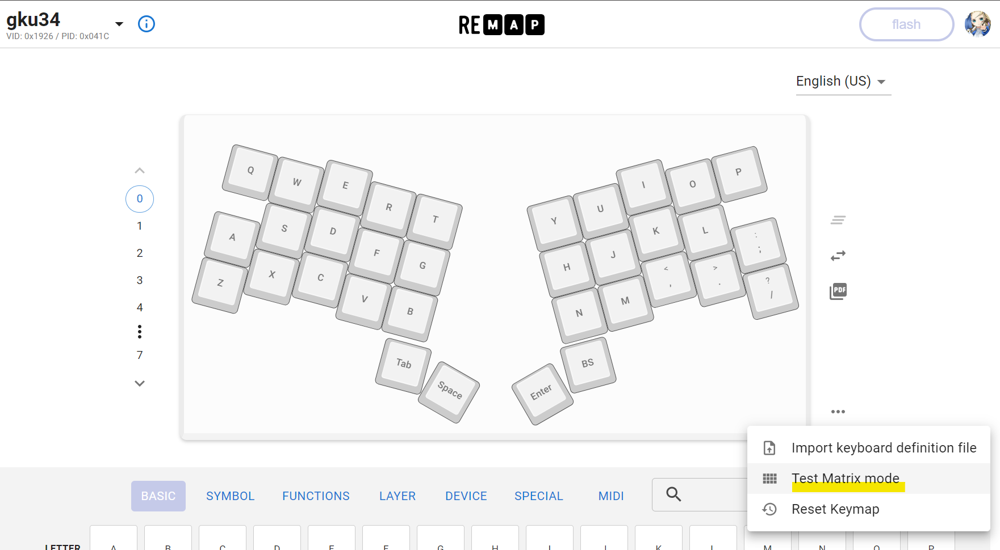
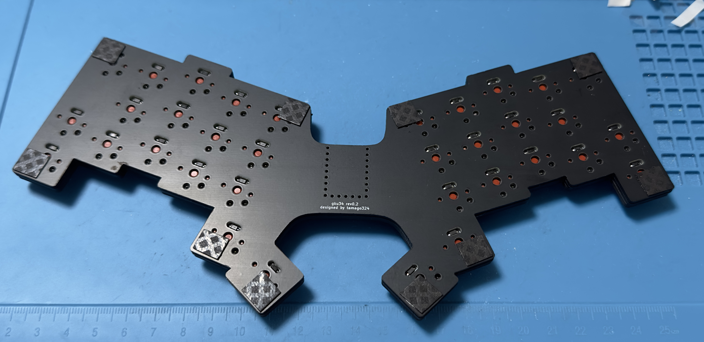

# gku34 ビルドガイド

gku34 rev0.3 のビルドガイドです。 (rev0.2との変更点は [Lofree スイッチ](https://www.lofree.co/products/lofree-x-kailh-full-pom-low-profile-switches)を使えるようにした点のみ)

目次

* [キットに含まれるもの](#キットに含まれるもの)
* [キット以外に必要なもの](#キット以外に必要なもの)
* [組み立て順序の確認](#組み立て順序の確認)
* [組み立て](#組み立て)
  * [1. プレートの側面をペンで塗る](#1プレートの側面をペンで塗る)
  * [2. RP2040-Zero のボタンをペンで塗る](#2rp2040-zero-のボタンをペンで塗る)
  * [3. ダイオードのはんだ付け](#3-ダイオードのはんだ付け)
  * [4. RP2040-Zero のはんだ付け](#4-rp2040-zero-のはんだ付け)
  * [5. 動作確認](#5-動作確認)
  * [6. スイッチのはんだ付け](#6-スイッチのはんだ付け)
  * [7. ボトムプレートを取り付ける](#7-ボトムプレートを取り付ける)
  * [8. ゴム足を取り付ける](#8-ゴム足を取り付ける)
  * [9. キーキャップを取り付ける](#9-キーキャップを取り付ける)
  * [10. キーマップの変更](#10-キーマップの変更)
* [最後に](#最後に)

## キットに含まれるもの

| No. | 名前                  | 数量        | 備考                                                                                                                                                                        |
|-----|-----------------------|-------------|-----------------------------------------------------------------------------------------------------------------------------------------------------------------------------|
| 1   | PCB                   | 1枚         | メインPCB                                                                                                                                                                   |
| 2   | ボトムプレート        | 1枚         | ボトムプレート                                                                                                                                                      |
| 3   | トッププレート        | 1枚         | JLCPCBで製造してもらった3Dプリント製のトッププレート                                                                                                           |
| 4   | ダイオード            | 34個 + 予備 | [遊舎工房](https://shop.yushakobo.jp/collections/all-keyboard-parts/products/a0800di-02-100)で購入できます。                                                                |
| 5   | ゴム足            | 10個 | [Amazon](https://amzn.asia/d/dPdWZld)で購入できます。                                                                |
| 6   | 両面テープ (5mm幅)    | -           | PCBとボトムプレートを張り合わせるために使用。  [Amazon](https://amzn.asia/d/8XeKmsn)で購入できます。 |
| 7   | ピンヘッダ | - | RP2040-Zero をまっすぐはんだ付けするために使用するピンヘッダ |

## キット以外に必要なもの

| 名前                     | 数量 | 備考                 |
|--------------------------|------|----------------------|
| RP2040-Zero             | 1個 |[スイッチサイエンス](https://www.switch-science.com/products/7886/) などで購入できます。 |
| キーキャップ            | 34個 | choc v1用、またはMX用キーキャップ  |
| キースイッチ             | 34個 | choc v1スイッチ、または [Lofree スイッチ](https://www.lofree.co/products/lofree-x-kailh-full-pom-low-profile-switches)         |
| USBケーブル              | 1個  | Type-C の USBケーブル |

## 組み立て順序の確認

1. プレートの側面をペンで塗る
2. RP2040-Zero のボタンをペンで塗る
3. ダイオードのはんだ付け
4. RP2040-Zero のはんだ付け
5. 動作確認
6. スイッチのはんだ付け
7. ボトムプレートを取り付ける
8. ゴム足を取り付ける
9. キーキャップを取り付ける
10. キーマップの変更

## 組み立て

### 1. プレートの側面をペンで塗る

PCB と ボトムプレートの側面を[ポスカ](https://amzn.asia/d/1ZZTGt9)などのペンで塗ります。

### 2. RP2040-Zero のボタンをペンで塗る

RP2040-Zero のボタンを[マッキー](https://amzn.asia/d/gaXAFb8)などのペンで塗ります。

これをすることにより、トッププレートを合わせたときに真っ黒になります。

### 3. ダイオードのはんだ付け

PCBの裏にダイオードを34個はんだ付けします。
「PCBのシルクの線」と「ダイオードの線」が一致するようにはんだ付けします。
はんだごての温度は320℃くらいに設定し作業します。

片側に予備ハンダを行い、
ピンセットを使用して、はんだ付けを行い、
もう片方もはんだ付けします。

すべてのダイオードのはんだ付けが終わったら、すべてのダイオードが同じ向きになっていることを確認してください。

### 4. RP2040-Zero のはんだ付け

「PCB の表面の 5V」が「RP2040-Zero の 5V」にあうように合わせます。

ピンヘッダを RP2040-Zero と PCB に刺して、まっすぐなるように合わせます。

RP2040-Zero の角を4箇所はんだ付けをし、浮いていないことを確認してから、すべてをはんだ付けします。

### 5. 動作確認

#### ファームウェアの書き込み

[Remap のファームウェア](https://remap-keys.app/catalog/Vax92NppUdpJnLsBweYy/firmware) のページからダウンロードし、

RP2040-Zero の左側のボタンを押しながら、USB を接続し、
新しいデバイスとしてファイルエクスプローラに表示されたデバイスに、ダウンロードしたファイルををコピーします。コピーが完了すると、デバイスが切断されます。
デバイスが切断されたら、ファームウェアの書き込みが完了です。

#### 入力の確認

[Remap](https://remap-keys.app/) にアクセスし、`START REMAP FOR YOUR KEYBOARD` ボタンをクリック

`+KEYBAORD` をクリックし、表示された `gku34` を選択し、`接続` をクリック

`Test Matrix Mode` をクリックし、入力の確認を行う。

スイッチのピンの穴をピンセットでショートさせることで入力を確認します。

### 6. スイッチのはんだ付け

rev0.3 は[Lofree スイッチ](https://www.lofree.co/products/lofree-x-kailh-full-pom-low-profile-switches)も取り付け可能です。

トッププレートとPCBを合わせて、PCBの表からスイッチを差し込み、裏からスイッチをはんだ付けします。
はんだごての温度は320℃くらいに設定し作業します。

ボトムプレートを張り付ける前に念のため、再度 Remap で入力の確認をしておきます。  
もし、入力がおかしい場合、ダイオードやスイッチの足にはんだごてをあてて、再度確認します。

### 7. ボトムプレートを取り付ける

両面テープをボトムプレートに貼り付け、PCBとボトムプレートがずれないように貼り付けます。

両面テープの貼る面は `Tape on this side` と書かれている面です。

### 8. ゴム足を取り付ける

ボトムプレートにゴム足を取り付けます。

### 9. キーキャップを取り付ける

キーキャップを取り付けます。

### 10. キーマップの変更

Remap か QMK か Vial を使用してキーマップを変更可能です。
* QMK の場合: [tamago324/qmk_firmware](https://github.com/tamago324/qmk_firmware/tree/tamago324_v2/keyboards/tamago324/gku34) の `tamago324` ブランチの `keyboards/tamago324/gku34` にファームウェアがあります。また、バージョンは 0.21系です
  * GPK FWMakerでビルドして書き込む場合は[こちら](../gpk_fwmaker_buide.md)
* Vial の場合: [こちら](../../firmware/vial/gku34_rev01_vial.uf2) の uf2 ファイルをダウンロードし、書き込むことで [vial](https://get.vial.today/) を使用してキーマップの変更ができます。
  * Vial のインストールなどについては[こちら](../vial_guide.md)
  * すでに Vial のキーマップを設定している場合には、エクスポートしてから書き込んでください。Vial のキーマップがデフォルトのキーマップで上書きされてしまいます。
* Remap の場合: キーボードカタログの gku34 のページで設定可能です。

## 最後に

完成したキーボードの写真を SNS に投稿していただけるととても嬉しいです！

(ハッシュタグは `#gku34` です。)

